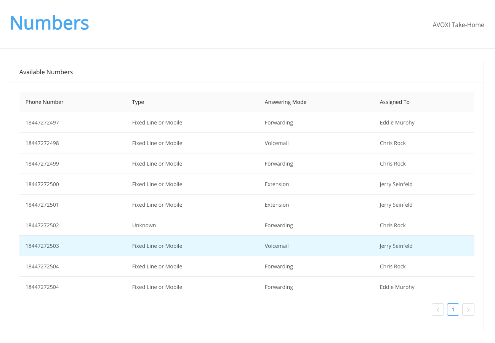

# AVOXI Full-stack Technical Test

We have stubbed out a small application for you to work with. This application is comprised of a single page application that closely mimics the Numbers page in one of our applications. The frontend was bootstraped with CRA, so if you have any experience with that tool the frontend development environment should be pretty familiar. There is also an API layer which is a single server.js file using express. There is one last layer: the database, which is a sqlite db packaged up in a file (appDB.db).

Below are the tasks that you will be asked to work through. You should spend roughly 4hrs completing as many of the tasks as possible. This take home technical test is your chance to wow us! Don't be afraid to be opinionated about implementation or design. We look forward to seeing your high quality code.

## Design Context

Although this is a single page application, we would like you to demonstrate a level of abstraction and state management appropriate for a larger scale application. While completing individual tasks is important, how you tackle those objectives carries equal weight (code organization, clarity, etc.).

## **Tasks**



1. On render, load the numbers from the api for the table to look like the above
2. Format Phone Numbers in international format using [libphonenumber-js](https://www.npmjs.com/package/libphonenumber-js) and add a Country column to the table
3. Add pagination to number fetching api and update ui to fetch numbers on page change

## BONUS

1. Add a visualization component to the page that shows the breakdown of numbers by region
2. Add the capability to edit a number in the table and save it to the databse

## Database Schema

```sql
CREATE TABLE `Numbers` (
  `id` INTEGER PRIMARY KEY AUTOINCREMENT,
  `number` INTEGER NOT NULL,
  `type` CHAR(50) NOT NULL
);
CREATE TABLE `Users` (
  `id` INTEGER PRIMARY KEY AUTOINCREMENT,
  `first_name` CHAR(50) NOT NULL,
  `last_name` CHAR(50) NOT NULL
);
CREATE TABLE `UserNumbers` (
  `user_id` INTEGER NOT NULL,
  `number_id` INTEGER NOT NULL,
  FOREIGN KEY(user_id) REFERENCES Users(id),
  FOREIGN KEY(number_id) REFERENCES Numbers(id)
);
CREATE TABLE `NumberConfiguration` (
  `id` INTEGER PRIMARY KEY AUTOINCREMENT,
  `number_id` INTEGER NOT NULL,
  `answering_mode` CHAR(50) NOT NULL,
  FOREIGN KEY(number_id) REFERENCES Numbers(id)
);
```

## To start up the application

- Go to the client directory `cd client` and install the dependencies `npm i`
- Install the dependencies at the root level `npm i`
- Start the app! `npm start`
